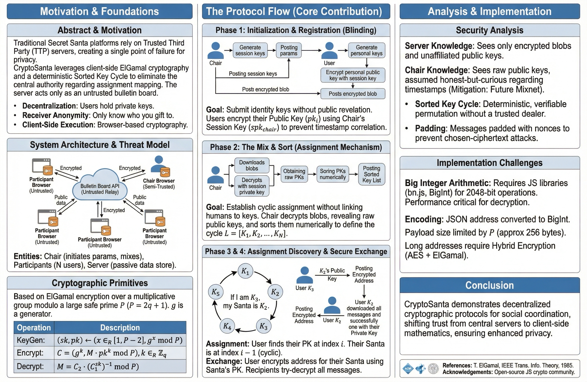

# CryptoSanta

**A Decentralized Secret Santa Protocol Using ElGamal Encryption and Sorted Key Cycles**

Traditional Secret Santa apps require you to trust a central server with everyone's assignments and addresses. CryptoSanta eliminates this trust requirement entirely—the server is just a dumb bulletin board that stores encrypted blobs. It never learns who is gifting to whom.

<p align="center">
  
</p>

## The Problem with Traditional Secret Santa Apps

When you use a typical Secret Santa website:
1. You enter everyone's names and email addresses
2. The server randomly assigns gift pairs
3. The server stores the complete assignment graph
4. The server emails everyone their assignments

**The privacy issues are obvious:** The server operator knows everything. They could leak it, get hacked, or simply be nosy.

## How CryptoSanta Solves This

CryptoSanta uses public-key cryptography to create assignments that **nobody** can see—not the server, not even the organizer (called "the Chair"). Here's the key insight:

> If we sort everyone's public keys numerically, we get a deterministic cycle. Your "Santa" is simply whoever has the key immediately before yours in the sorted list.

This means assignments are **intrinsic to the keys themselves**—no trusted party needs to shuffle a deck or make random assignments.

## The Protocol in Plain English

### Phase 1: Setup & Registration

1. **The Chair creates a room** with cryptographic parameters (a large prime number and generator)
2. **Each participant generates a key pair** in their browser—a private key (kept secret) and a public key
3. **Participants register** by encrypting their public key and posting it to the bulletin board

### Phase 2: The Sort

4. **The Chair downloads all encrypted keys**, decrypts them, and sorts them numerically
5. **The sorted list is posted** to the bulletin board for everyone to see

### Phase 3: Assignment Discovery

6. **Each participant finds their position** in the sorted key list
7. **Your Secret Santa is the key before yours** in the cycle (wrapping around at the end)

```
Sorted Keys: [K1, K2, K3, K4, K5]

If you are K3:
  - Your Santa (gives TO you): K2
  - Your Santee (you give TO): K4
```

### Phase 4: Address Exchange

8. **You encrypt your address** with your Santa's public key and post it to the bulletin board
9. **Your Santa downloads all messages** and tries to decrypt each one—only yours will work
10. **Your Santa now has your address** and can send you a gift!

## Why This Works

### The Sorted Key Cycle

By sorting public keys numerically, we create a cycle without any randomness or trusted dealer:

```
K1 → K2 → K3 → K4 → K5 → K1 (wraps around)
```

Everyone can verify this cycle is correct by checking the sort order. No one can manipulate it without changing their public key (which would be obvious).

### ElGamal Encryption

We use ElGamal encryption because it's based on the discrete logarithm problem—given `g^x mod P`, it's computationally infeasible to find `x`. This means:

- Only the intended recipient can decrypt a message
- The server sees only encrypted blobs
- Even if someone records all traffic, they can't read the messages

### The Bulletin Board Model

The server is intentionally "dumb"—it just stores and serves data:

```
POST /room/:id/register    → Store encrypted public key
POST /room/:id/sort        → Store sorted key list
POST /room/:id/message     → Store encrypted address
GET  /room/:id/messages    → Return all encrypted messages
```

No business logic. No decryption. No assignment computation. Just storage.

## Security Properties

| Property | Guarantee |
|----------|-----------|
| **Server learns assignments?** | No—only sees encrypted blobs |
| **Server learns addresses?** | No—addresses are encrypted end-to-end |
| **Participants learn others' assignments?** | No—each person only learns their own Santa/Santee |
| **Chair learns assignments?** | Partially—see threat model below |

### The Chair Threat Model

The Chair is "honest-but-curious"—they follow the protocol but might try to learn extra information. The Chair:

- ✅ Cannot decrypt address messages (doesn't have participants' private keys)
- ✅ Cannot modify the assignment cycle (public keys are cryptographically bound)
- ⚠️ Could potentially correlate registration timestamps to public keys

**Mitigation:** In practice, if multiple people register around the same time, correlation becomes difficult. Future versions could implement blind signatures or mixnets to eliminate this entirely.

## Technical Details

### Cryptographic Parameters

- **Prime (P):** 2048-bit safe prime from RFC 3526 (MODP Group 14)
- **Generator (g):** 2 (standard for this group)
- **Key space:** ~2^2048 possible keys

### Message Encoding

ElGamal encrypts numbers, not strings. We handle this by:

1. Converting JSON to UTF-8 bytes
2. Prepending a 128-bit random nonce (prevents dictionary attacks)
3. Converting to a BigInt

For messages longer than ~200 bytes, we use **hybrid encryption**:
- Generate a random AES-256 key
- Encrypt the message with AES-GCM
- Encrypt only the AES key with ElGamal

### Quadratic Residue Requirement

To prevent information leakage, all public keys must be quadratic residues mod P. We enforce this by regenerating keys that fail Euler's criterion:

```
y^((P-1)/2) ≡ 1 (mod P)
```

## Running CryptoSanta

### Backend (Python + Modal)

```bash
uv sync
uv run modal deploy backend/main.py
```

### Frontend (React + Vite)

```bash
cd frontend
pnpm install
pnpm dev      # Development
pnpm build    # Production
```

### Configuration

Create `frontend/.env`:
```
VITE_API_URL=https://your-modal-deployment.modal.run
```

## Architecture

```
┌─────────────────────────────────────────────────────────────┐
│                        BROWSER                              │
│  ┌─────────────┐  ┌─────────────┐  ┌─────────────────────┐  │
│  │   KeyGen    │  │  Encrypt/   │  │    LocalStorage     │  │
│  │  (ElGamal)  │  │  Decrypt    │  │  (Private Keys)     │  │
│  └─────────────┘  └─────────────┘  └─────────────────────┘  │
└────────────────────────┬────────────────────────────────────┘
                         │ HTTPS (encrypted blobs only)
                         ▼
┌─────────────────────────────────────────────────────────────┐
│                    BULLETIN BOARD                           │
│           (Modal + FastAPI + Modal Dict)                    │
│                                                             │
│   Stores: encrypted keys, sorted list, encrypted messages   │
│   Knows:  nothing about assignments or addresses            │
└─────────────────────────────────────────────────────────────┘
```

## Project Structure

```
cryptosanta/
├── backend/
│   ├── api/routes.py       # REST endpoints
│   ├── crypto/params.py    # RFC 3526 constants
│   ├── models/room.py      # Pydantic schemas
│   ├── storage/room_store.py  # Modal Dict with optimistic locking
│   └── main.py             # Modal ASGI entry
├── frontend/
│   ├── src/
│   │   ├── crypto/         # ElGamal, hybrid encryption, encoding
│   │   ├── api/client.ts   # Typed API client
│   │   ├── store/          # Zustand (persisted to localStorage)
│   │   ├── pages/          # HomePage, RoomPage
│   │   └── components/     # Lobby, Assignment, Inbox screens
│   └── ...
└── README.md
```

## Future Improvements

1. **Blind Signatures:** Eliminate Chair's ability to correlate registration timestamps
2. **Mixnet Integration:** Add an anonymizing relay layer for registration
3. **Verifiable Shuffle:** Cryptographic proof that the Chair sorted correctly
4. **Threshold Decryption:** Require multiple Chairs to prevent single point of compromise

## References

- T. ElGamal, "A Public Key Cryptosystem and a Signature Scheme Based on Discrete Logarithms," IEEE Transactions on Information Theory, 1985
- RFC 3526: More Modular Exponential (MODP) Diffie-Hellman groups
- Web Crypto API: https://developer.mozilla.org/en-US/docs/Web/API/Web_Crypto_API

## License

MIT
